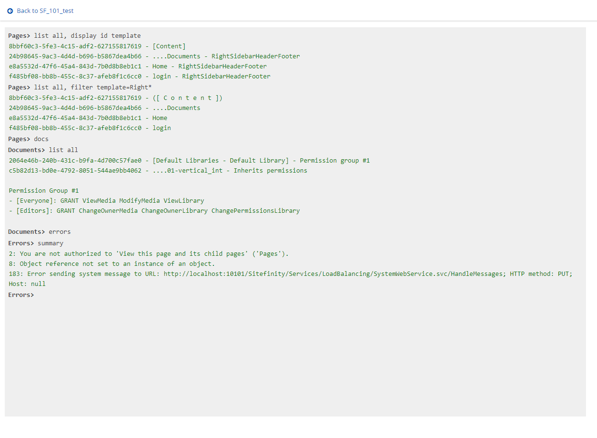

# Sitefinity Shell

### WARNING: This is provided AS-IS and is NOT an official Sitefinity package.

Sitefinity Shell is a backend command-line tool for the [Sitefinity CMS](http://www.sitefinity.com) to help improve some administrative tasks like:

- Find pages with certain characteristics - those with the Require SSL field, a certain template or cache setting
- Modify some pages for a particular subtree: change the Require SSL flag, the cache settings, or trim older versions
- Republish some parts of a site - a page subtree, only the pages with a particular, all the images... or all the content of your site (including Dynamic Modules)
- Examine the error logs from Sitefinity even if the process holds a lock on them
- Determine what errors are the most common, or what URLs generate the most errors
- Examine the SiteSync logs, including a full comparison between what the Source and the Destination site logs

## Documentation

Check [here](documentation.md)

## How to install

Just copy the files from the bin folder to Sitefinity's bin folder. Sitefinity will automatically add a "Shell" page in the Administration menu.

To uninstall:
- Delete the SitefinityShell.* files
- Go to Administration / Backend Pages to delete the Shell page
